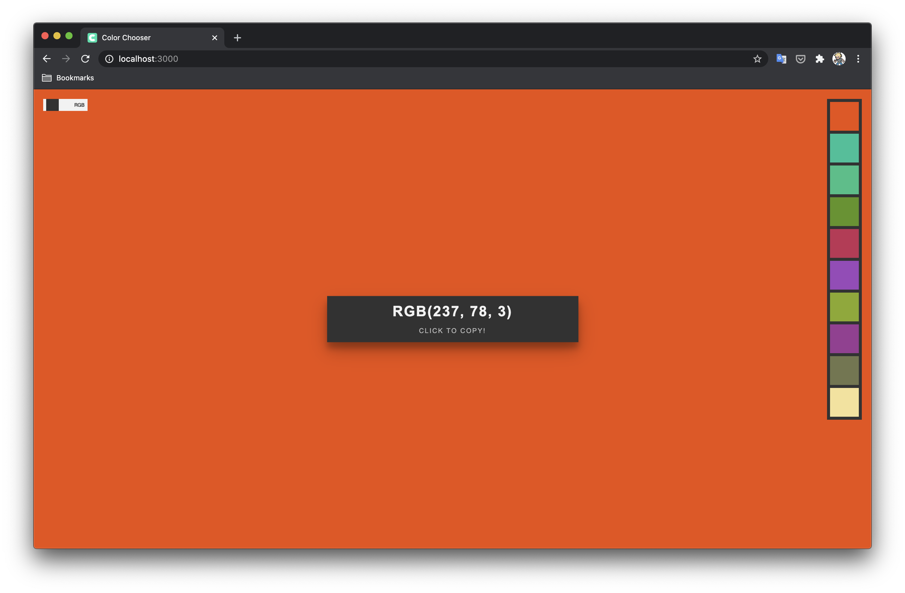

# Color Chooser App (PWA) [Demo](https://distracted-heisenberg-3ebfb7.netlify.app)

## Stack:
React + GSAP

## Usage
To run this project on local machine:

```bash
$: git clone https://github.com/plexideas/color-chooser.git
$: cd color-chooser
$: yarn
$: yarn start
```

## Screenshot


